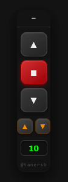

# 🖱️ Auto Scroll Manager

**A sophisticated userscript for seamless web reading and content consumption.**
*Smooth scrolling, smart target detection, and automated shorts/reels navigation.*

  <a href="#-features">Features</a> •
  <a href="#-controls">Controls</a> •
  <a href="#-installation">Installation</a>

---

## 📸 Preview

> *The widget launches in a minimized state (icon mode) to keep your screen clutter-free.*

---

## 🌟 Key Features

| Feature | Description |
| :--- | :--- |
| **⚡ Butter Smooth** | Utilizes `requestAnimationFrame` for stutter-free scrolling (**60/144Hz optimized**), replacing clunky interval methods. |
| **🕶️ Distraction-Free** | The green target border automatically **disappears** when minimized, giving you a clean reading view while scrolling continues. |
| **🎯 Smart Targeting** | Automatically identifies and locks onto scrollable areas (comments, sidebars, or main feed) with a single click. |
| **👻 Unobtrusive** | Starts minimized by default. No screen clutter from the moment the page loads. |
| **🧠 Intelligent Memory** | Remembers the widget's exact screen position and your preferences across page reloads and tabs. |
| **📱 Timer Mode** | Dedicated loop mode for **Instagram Reels, YouTube Shorts, or TikTok**. Auto-swipes after a set time (e.g., 15s). |

---

## 🎮 Controls

### 📖 1. Continuous Scrolling (Reading Mode)
*Ideal for articles, forums, PDFs, and long feeds.*

* **⬆️ / ⬇️ Arrows:** Initiates scrolling. Clicking repeatedly acts as a **"gas pedal"**, increasing the speed.
* **🔢 Input Box:** Manually type a specific speed value (e.g., `5`) and press an arrow to start immediately at that pace.
* **🟥 Stop Button:** Halts scrolling instantly **without resetting** your speed setting, allowing for a quick resume.

### ⏳ 2. Timer Mode (Content Loop)
*Located above the input box, designed for short-form video platforms.*

* **⏱️ Set Duration:** Type the seconds in the input box (e.g., `10`).
* **🔽 Small Arrows:** Activates the countdown.
* **🔄 Behavior:** Waits for the set duration, performs a full scroll action (simulating a swipe), and repeats the cycle.

---

## 🚀 Installation

You can get this script running in less than a minute:

1.  **Install Tampermonkey:** Download the extension for your browser from [Tampermonkey.net](https://www.tampermonkey.net/).
2.  **Create New Script:** Open the Tampermonkey dashboard and click the `+` icon.
3.  **Paste Code:** Copy the contents of `script.js` from this repository and paste it into the editor.
4.  **Save:** Press `Ctrl+S` or click the Save icon.

---

**Developed by [@tanersb](https://github.com/tanersb)**

